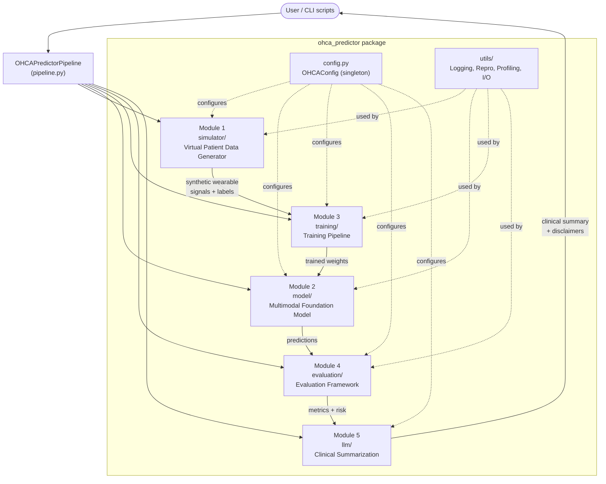
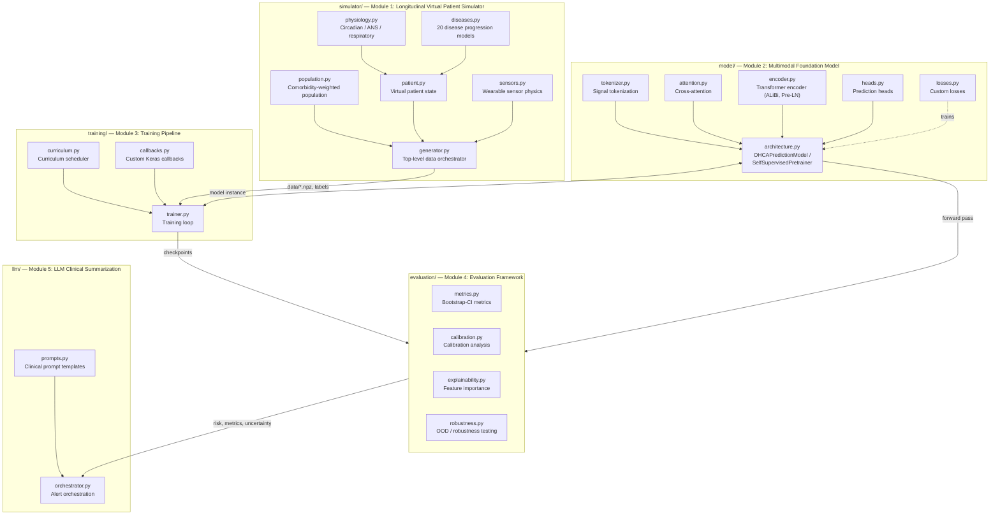
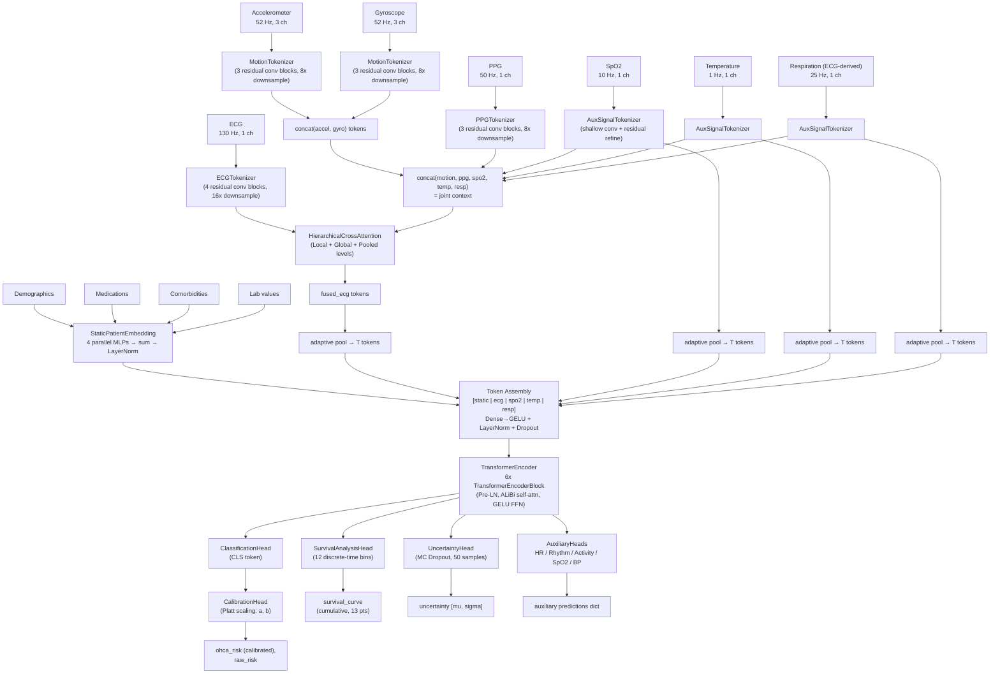

# CVDGaurd
## Multimodal Wearable AI System for Predicting Out-of-Hospital Cardiac Arrest (OHCA)

A production-ready Python system that forecasts Out-of-Hospital Cardiac Arrest up to 4 hours in advance by processing multi-modal wearable sensor streams from a wrist-worn device.
https://huggingface.co/sharktide/ohca-predictor-v1

---

## Architecture

```
ohca_predictor/
├── config.py                      # Centralized configuration system
├── simulator/                     # Module 1: Longitudinal Virtual Patient Simulator
│   ├── patient.py                 # Virtual patient state representation
│   ├── physiology.py              # Physiological subsystems (circadian, ANS, respiratory)
│   ├── diseases.py                # Disease progression models (20 disease types)
│   ├── sensors.py                 # Wearable sensor physics simulation
│   ├── population.py              # Population generator with comorbidity distributions
│   └── generator.py               # Top-level data generation orchestrator
├── model/                         # Module 2: Multimodal Foundation Model
│   ├── tokenizer.py               # Signal tokenization layers
│   ├── attention.py               # Cross-attention mechanisms
│   ├── encoder.py                 # Transformer encoder blocks
│   ├── heads.py                   # Prediction heads
│   ├── architecture.py            # Complete model assembly
│   └── losses.py                  # Custom loss functions
├── training/                      # Module 3: Training Pipeline
│   ├── trainer.py                 # Training loop and orchestration
│   ├── callbacks.py               # Custom Keras callbacks
│   └── curriculum.py              # Curriculum learning scheduler
├── evaluation/                    # Module 4: Evaluation Framework
│   ├── metrics.py                 # All evaluation metrics with bootstrap CI
│   ├── calibration.py             # Calibration analysis
│   ├── explainability.py          # Feature importance and interpretability
│   └── robustness.py              # Robustness and OOD testing
├── llm/                           # Module 5: LLM Clinical Summarization
│   ├── orchestrator.py            # Alert orchestration layer
│   └── prompts.py                 # Clinical prompt templates
├── utils/                         # Utility modules
│   ├── logging.py                 # Structured logging
│   ├── visualization.py           # Visualization tools
│   ├── reproducibility.py         # Deterministic execution
│   ├── profiling.py               # Performance profiling
│   └── io_utils.py                # Data I/O utilities
├── tests/                         # Unit tests
└── scripts/                       # Executable scripts
```

## Quick Start

### Installation

```bash
pip install -e .
```

### Generate Synthetic Data

```bash
python -m ohca_predictor.scripts.generate_data \
    --num-patients 1000 \
    --output-dir data/ \
    --seed 42
```

### Train Model

```bash
python -m ohca_predictor.scripts.train \
    --data-dir data/ \
    --output-dir models/ \
    --epochs 100 \
    --seed 42
```

### Evaluate Model

```bash
python -m ohca_predictor.scripts.evaluate \
    --checkpoint models/best_model \
    --data data/test/ \
    --output-dir evaluation/
```

## Key Design Decisions

1. **Latent Physiological States**: OHCA is modeled as culmination of complex physiological deterioration, not direct label assignment
2. **Asymmetric Cross-Attention**: ECG queries motion context for artifact detection
3. **Pre-Norm Transformer**: More stable training with deep networks and mixed precision
4. **ALiBi Positional Encoding**: Handles variable-length sequences without maximum position limits
5. **Clinically Weighted Loss**: 10:1 false-negative to false-positive weight (missed OHCA = death)
6. **Discrete-Time Survival Analysis**: Temporal resolution for "when is risk highest?"
7. **Monte Carlo Dropout**: Epistemic uncertainty estimation for clinical flagging
8. **Curriculum Learning**: Gradually increases task difficulty for better convergence
9. **Hard Negative Cohorts**: 12 categories of patients with ECG abnormalities but no OHCA risk

## Clinical Safety

- All LLM outputs include medical disclaimers
- Model provides uncertainty estimates for flagging uncertain cases
- Survival analysis provides temporal risk resolution
- Extensive calibration analysis ensures reliable probability estimates
- Robustness testing validates performance under distribution shift

## Requirements

- Python >= 3.9
- TensorFlow >= 2.12.0
- NumPy >= 1.23.0
- SciPy >= 1.10.0
- Scikit-Learn >= 1.2.0

# OHCA Predictor — Architecture Diagrams

Source: [sharktide/CVD-Predict](https://github.com/sharktide/CVD-Predict), package `ohca_predictor`.
All diagrams are generated directly from the source code (`config.py`, `pipeline.py`, and the `model/` submodule: `tokenizer.py`, `attention.py`, `encoder.py`, `heads.py`, `losses.py`, `architecture.py`).

---

## PART 1 — Repository / System Architecture

### 1.1 High-Level Architecture



### 1.2 Medium-Level Architecture (module → file breakdown)



### 1.3 Low-Level Architecture (classes / key entry points)

```mermaid
flowchart TD
    CLI1["scripts/generate_data.py"] --> genfn["simulator.generator\n(top-level generation fn)"]
    CLI2["scripts/train.py"] --> Trainer["training.trainer.Trainer"]
    CLI3["scripts/evaluate.py"] --> EvalRunner["evaluation.metrics\n+ calibration + robustness"]
    CLI4["scripts/benchmark.py"] --> Prof["utils.profiling"]
    CLI5["scripts/profile.py"] --> Prof

    subgraph CFG["config.py dataclasses"]
        OHCAConfig["OHCAConfig\n(root, singleton via get_config())"]
        ReproCfg["ReproducibilityConfig\nseed=42"]
        SimCfg["SimulationConfig\nsampling_rates, windows"]
        DiseaseCfg["DiseaseConfig\n20 disease_types"]
        SensorCfg["SensorConfig\nADC/BLE/electrode physics"]
        ModelCfg["ModelConfig\ntransformer hyperparams"]
        TrainCfg["TrainingConfig\noptimizer/loss weights"]
        EvalCfg["EvaluationConfig\nbootstrap/thresholds"]
        LLMCfg["LLMConfig\nendpoint/model_id"]
        OHCAConfig --> ReproCfg & SimCfg & DiseaseCfg & SensorCfg & ModelCfg & TrainCfg & EvalCfg & LLMCfg
    end

    genfn --> population["population.PopulationGenerator"]
    genfn --> patientcls["patient.VirtualPatient"]
    patientcls --> physio["physiology.*Subsystem"]
    patientcls --> diseasecls["diseases.DiseaseModel(type)"]
    genfn --> sensorcls["sensors.SensorPhysics"]

    Trainer --> OHCAModel["architecture.OHCAPredictionModel(keras.Model)"]
    Trainer --> Pretrainer["architecture.SelfSupervisedPretrainer(keras.Model)"]
    Trainer --> CombinedLoss["losses.CombinedOHCALoss"]
    Trainer --> CB["callbacks.*"]
    Trainer --> Curr["curriculum.CurriculumScheduler"]

    OHCAModel --> Tokenizers["ECGTokenizer, MotionTokenizer x2,\nPPGTokenizer, AuxSignalTokenizer x3"]
    OHCAModel --> Attn["AsymmetricCrossAttention x2,\nHierarchicalCrossAttention"]
    OHCAModel --> Enc["TransformerEncoder\n(6x TransformerEncoderBlock)"]
    OHCAModel --> Heads["ClassificationHead, SurvivalAnalysisHead,\nUncertaintyHead, AuxiliaryHeads, CalibrationHead"]

    EvalRunner --> metricsfn["metrics.compute_bootstrap_ci"]
    EvalRunner --> calibfn["calibration.reliability_diagram"]
    EvalRunner --> explainfn["explainability.attribution"]
    EvalRunner --> robustfn["robustness.ood_detection\n(mahalanobis)"]

    Pipeline["pipeline.OHCAPredictorPipeline"] --> OHCAModel
    Pipeline --> EvalRunner
    Pipeline --> LLMOrch["llm.orchestrator.AlertOrchestrator"]
    LLMOrch --> LLMPrompts["llm.prompts.CLINICAL_TEMPLATES"]
    OHCAConfig -.injected into.-> Pipeline
```



---

## PART 2 — Model Architecture (`OHCAPredictionModel`)

### 2.1 High-Level Architecture

```mermaid
flowchart LR
    Raw["7 raw wearable\nsignal streams\n+ 4 static feature vectors"] --> Tok["1. Tokenization\n(per-modality CNN tokenizers)"]
    Tok --> Fuse["2–3. Motion fusion +\nCross-modal attention"]
    Fuse --> Align["4. Sequence alignment\n(adaptive pooling to T tokens)"]
    Align --> Assemble["5. Token assembly\n(static + signal tokens)"]
    Assemble --> Enc["6. Transformer Encoder\n6 layers, Pre-LN, ALiBi"]
    Enc --> Heads["7. Prediction Heads\nclassification / survival /\nuncertainty / auxiliary"]
    Heads --> Cal["8. Calibration\n(Platt scaling)"]
    Cal --> Out["Calibrated OHCA risk +\nsurvival curve + uncertainty +\nauxiliary clinical predictions"]
```



### 2.2 Medium-Level Architecture



### 2.3 Low-Level Architecture (full hyperparameters)

```mermaid
flowchart TD
    subgraph GLOBAL["Global ModelConfig hyperparameters"]
        MD["model_dim = 256"]
        NH["num_attention_heads = 8 → key_dim = 32"]
        NL["num_encoder_layers = 6"]
        FF["feedforward_dim = 1024 (4x model_dim)"]
        DR["dropout_rate = 0.1"]
        ADR["attention_dropout_rate = 0.1"]
        SED["static_embedding_dim = 64"]
        MPE["max_positional_encoding = 8192"]
        NSB["num_survival_bins = 12"]
        US["uncertainty_samples = 50 (MC Dropout)"]
        TPM["tokens_per_modality (T) = 512"]
    end

    subgraph ECGT["ECGTokenizer (16x downsample)"]
        e0["Conv1D 32f, k=15, s=1, causal, BN+GELU"]
        e1["ResBlock1: 64f, k=7, dil=1, s=2"]
        e2["ResBlock2: 128f, k=5, dil=2, s=2"]
        e3["ResBlock3: 256f, k=3, dil=4, s=2"]
        e4["ResBlock4: 256f(=model_dim), k=3, dil=8, s=2"]
        e5["AdaptiveAvgPool1D → 512 tokens"]
        e6["+ Learned positional embedding"]
        e0-->e1-->e2-->e3-->e4-->e5-->e6
    end

    subgraph MOTT["MotionTokenizer x2 (accel, gyro; 8x downsample)"]
        m0["Conv1D 32f, k=15, s=1, causal"]
        m1["ResBlock1: 64f, k=7, dil=1, s=2"]
        m2["ResBlock2: 128f, k=5, dil=2, s=2"]
        m3["ResBlock3: 256f, k=3, dil=4, s=2"]
        m4["AdaptiveAvgPool1D → 512 tokens + pos-emb"]
        m0-->m1-->m2-->m3-->m4
    end

    subgraph PPGT["PPGTokenizer (8x downsample)"]
        p0["Conv1D 32f, k=11, s=1, causal"]
        p1["ResBlock1: 64f, k=7, dil=1, s=2"]
        p2["ResBlock2: 128f, k=5, dil=2, s=2"]
        p3["ResBlock3: 256f, k=3, dil=4, s=2"]
        p4["AdaptiveAvgPool1D → 512 tokens + pos-emb"]
        p0-->p1-->p2-->p3-->p4
    end

    subgraph AUXT["AuxSignalTokenizer x3 (SpO2, Temp, Resp)"]
        direction TB
        a0{"samples < 64?"}
        a1["Short path: Dense→256 GELU,\nDense→(256×model_dim), reshape"]
        a2["Long path: interp to 256,\nConv1D 256f k=5 + BN/GELU,\n2x dilated residual refine (k=3, dil 1 & 2)"]
        a3["AdaptiveAvgPool1D → 512 tokens + pos-emb"]
        a0 -- yes --> a1 --> a3
        a0 -- no --> a2 --> a3
    end

    subgraph STAT["StaticPatientEmbedding (static_embedding_dim=256 at model level)"]
        s1["Demographics MLP: Dense 32 GELU → Dropout 0.1 → Dense 256"]
        s2["Medications MLP: Dense 32 GELU → Dropout 0.1 → Dense 256"]
        s3["Comorbidities MLP: Dense 32 GELU → Dropout 0.1 → Dense 256"]
        s4["Labs MLP: Dense 32 GELU → Dropout 0.1 → Dense 256"]
        s5["sum → LayerNorm(eps=1e-6) → expand_dims(axis=1)"]
        s1-->s5
        s2-->s5
        s3-->s5
        s4-->s5
    end

    subgraph HCADET["HierarchicalCrossAttention (num_heads=8)"]
        h1["Level 1 Local: AsymmetricCrossAttention\nwindow=7 tokens, masked"]
        h2["Level 2 Global: AsymmetricCrossAttention\nfull context, MultiHeadAttention key_dim=32"]
        h3["Level 3 Pooled: GAP(ecg) & GAP(ctx)\n→ Dense GELU → AsymmetricCrossAttention"]
        h4["concat[local, global, pooled_broadcast]\n(768-dim) → Dense 256 GELU"]
        h5["LayerNorm(eps=1e-6) → Dropout 0.1"]
        h1-->h4
        h2-->h4
        h3-->h4
        h4-->h5
    end

    subgraph ENCBLOCK["TransformerEncoderBlock x6 (Pre-LN)"]
        direction TB
        b1["LayerNorm(eps=1e-6)"]
        b2["Multi-Head Self-Attention w/ ALiBi bias\nheads=8, key_dim=32, value_dim=32"]
        b3["Dropout 0.1 → residual add"]
        b4["LayerNorm(eps=1e-6)"]
        b5["FFN: Dense 1024 GELU → Dropout 0.1\n→ Dense 256 → Dropout 0.1"]
        b6["residual add"]
        b1-->b2-->b3-->b4-->b5-->b6
    end

    subgraph HEADSDET["Prediction Heads"]
        c1["ClassificationHead:\nDense 256 GELU → Dense 64 GELU → Dense 1 Sigmoid"]
        c2["SurvivalAnalysisHead:\nDense 128 GELU → Dense 12 Sigmoid (hazards)\n→ cumulative product → survival_curve (13 pts)"]
        c3["UncertaintyHead:\nDense 64 GELU → Dense 2 [mu, log_sigma]\n(MC Dropout, 50 stochastic passes at inference)"]
        c4["AuxiliaryHeads (all Dense 64 GELU → output):\nHeart Rate (1, linear) · Rhythm (5, softmax)\nActivity (5, softmax) · SpO2 (1, linear) · BP (2, linear)"]
        c5["CalibrationHead:\nPlatt scaling sigmoid(a·logit(p)+b)\ninit a=1.0, b=0.0, temperature=1.0"]
        c1-->c5
    end

    subgraph LOSSDET["CombinedOHCALoss (training/losses.py)"]
        l1["ClinicallyWeightedBCE\nFN weight=10.0 : FP weight=1.0"]
        l2["FocalLoss γ=2.0 (class imbalance)"]
        l3["DiscreteTimeSurvivalLoss\nweight=0.3"]
        l4["ContrastiveLoss (SimCLR/InfoNCE)\nweight=0.2, temperature=0.07"]
        l5["ReconstructionLoss (masked ECG, 15% mask)\nweight=0.15"]
        l6["Auxiliary task loss\nweight=0.1"]
    end

    subgraph OPT["Optimizer / Training hyperparameters"]
        o1["batch_size=32, grad_accum_steps=4\n(effective batch=128)"]
        o2["epochs=100, lr=1e-4 → min_lr=1e-7"]
        o3["warmup_steps=1000, weight_decay=0.01"]
        o4["gradient_clip_norm=1.0, mixed_precision=True"]
        o5["early_stopping_patience=15"]
    end
```



---

### Key numeric hyperparameter summary

| Parameter | Value |
|---|---|
| `model_dim` | 256 |
| `num_attention_heads` | 8 (key/value dim = 32 each) |
| `num_encoder_layers` | 6 |
| `feedforward_dim` | 1024 |
| `dropout_rate` / `attention_dropout_rate` | 0.1 / 0.1 |
| `tokens_per_modality` | 512 |
| `static_embedding_dim` | 64 (config default; 256 at model instantiation) |
| `max_positional_encoding` | 8192 |
| `num_survival_bins` | 12 |
| `uncertainty_samples` (MC Dropout) | 50 |
| `local_window_size` (hierarchical attn) | 7 |
| Pretraining mask ratio / InfoNCE temperature | 0.15 / 0.07 |
| `batch_size` / `gradient_accumulation_steps` | 32 / 4 |
| `learning_rate` → `min_learning_rate` | 1e-4 → 1e-7 |
| `warmup_steps` / `weight_decay` | 1000 / 0.01 |
| `gradient_clip_norm` | 1.0 |
| `focal_loss_gamma` | 2.0 |
| `false_negative_weight : false_positive_weight` | 10.0 : 1.0 |
| Loss weights (survival / auxiliary / contrastive / reconstruction) | 0.3 / 0.1 / 0.2 / 0.15 |
| `early_stopping_patience` | 15 |
